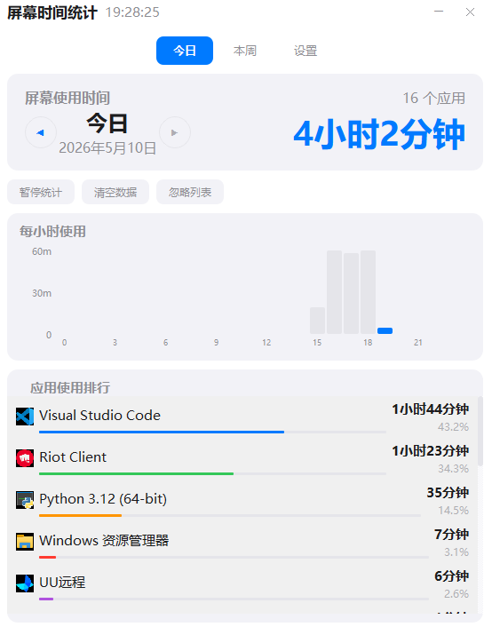
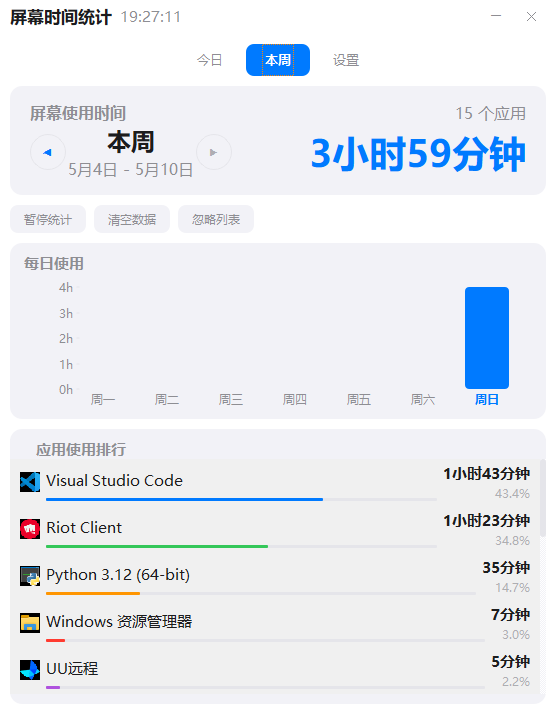

# UsageTime

Windows 桌面屏幕使用时间统计工具，帮助你了解每天在各个应用上花费的时间。


## 功能特性

- **实时监控** — 每秒检测前台窗口，精确记录应用使用时长
- **智能休眠** — 自动检测无操作状态，停止计时避免空挂误计
- **今日统计** — 24 小时柱状图，直观展示每小时使用分布
- **本周统计** — 7 天柱状图，一目了然每周使用趋势
- **应用排行** — 按使用时长排序，支持自定义应用名称映射
- **快捷方式识别** — 自动读取桌面/开始菜单快捷方式的名称和图标
- **系统托盘** — 最小化到托盘后台运行，左键点击打开面板
- **暂停/恢复** — 临时停止统计，自由控制
- **忽略列表** — 排除不需要统计的应用
- **开机自启** — 一键设置开机自动启动
- **隐私保护** — 所有数据仅存本地 SQLite 数据库，不联网、不上传、不采集任何个人信息

## 界面预览





## 安装

### 方式一：下载发行版

前往 [Releases](https://github.com/DABIAN-afk/usagetime/releases) 下载最新版本，解压后双击 `UsageTracker.exe` 即可使用。

### 方式二：从源码运行

```bash
git clone https://github.com/DABIAN-afk/usagetime.git
cd ScreenTime
pip install -r requirements.txt
python main.py
```

### 方式三：自行打包

```bash
pip install -r requirements.txt
pip install pyinstaller

python generate_icon.py
pyinstaller app.spec --clean
```

打包产物在 `dist/UsageTracker/` 目录下。

## 技术栈

- **UI 框架**: PySide6 (Qt for Python)
- **数据库**: SQLite (WAL 模式)
- **进程监控**: psutil + Win32 API (GetForegroundWindow)
- **空闲检测**: Win32 API (GetLastInputInfo)
- **图标提取**: Win32 IImageList + SHGetFileInfo
- **打包**: PyInstaller

## 隐私声明

- 所有数据仅存储在本地 SQLite 数据库中
- 不收集任何个人信息
- 不进行任何网络请求
- 不记录键盘输入内容
- 不截取屏幕
- 不上传任何数据

## License

MIT
